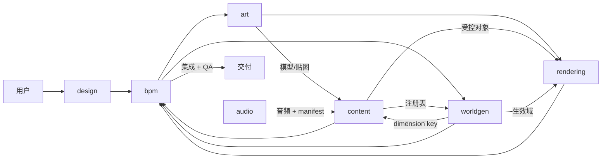

> Orchestration skill for a 7-role subagent team building complex Minecraft mods (e.g. a custom dimension/sub-world). Each reference below is a ready-to-use subagent definition in the Claude Code subagent format (YAML frontmatter + system prompt body): copy the files into `.claude/agents/` or use them as role cards when spawning subagents.

## Prerequisite — 依赖检测与自动安装

使用本 skill 前，先确认默认模型是否支持多模态，再检测配套 skills 是否已安装：

- **默认模型是多模态**（能直接看图）：需要 `minecraft-modding`、`fabric`、`geckolib`、`veil`、`imagine`、`minecraft-model`、`minecraft-texture`、`sonic` 共 8 个
- **默认模型不是多模态**：额外安装可选项 `vision`，用于把图片转成文本描述供主模型处理

```bash
npx skills list        # 或 npx skills ls -g（查全局）
npx skills add hairyf/skills -s minecraft-modding fabric geckolib veil imagine minecraft-model minecraft-texture sonic -y
# 非多模态时追加：npx skills add hairyf/skills -s vision -y
# 或全部：npx skills add hairyf/skills --all
```

安装后按各 skill 的 `core-setup` 完成配置：

- `imagine` / `sonic`：配置对应 API key（OpenAI / SiliconFlow / Google 等）并合并 AGENTS.md
- `vision`（仅非多模态时）：配置对应 vision API key 并合并 AGENTS.md
- `minecraft-model`：确认 Blockbench MCP 已安装并运行
- `minecraft-texture`：确认 Python 环境可用

## When to Use

- 规划或执行一个复杂 Minecraft 模组（子世界/维度）的多 Agent 开发
- 需要分波调度（并发槽含主会话共 4，同时最多 3 个子 Agent）
- 需要"用户审查门禁"保证地形/美术/音频/渲染等主观产物符合预期

## Core References

| Agent | Responsibility | Reference |
|-------|----------------|-----------|
| design | 策划设计：世界观、玩法、内容清单、数值、玩家旅程，产出 `docs/design.md` | [design](references/design.md) |
| bpm | BPM 调用管理：任务拆分、波次调度、契约维护、门禁放行、冲突仲裁 | [bpm](references/bpm.md) |
| worldgen | 维度本体 + 世界生成：DimensionType/Dimension、biome、feature、structure、刷怪 | [worldgen](references/worldgen.md) |
| content | 核心枢纽：方块/物品/流体/实体/音效注册、交互、传送，整合 art/audio/worldgen 产出 | [content](references/content.md) |
| art | 概念设计、三视图、Blockbench 建模、贴图后处理（必须多模态模型） | [art](references/art.md) |
| audio | 必选：BGM、环境音、生物/方块/UI 音效 + audio-manifest | [audio](references/audio.md) |
| rendering | Veil 渲染专项：天空/雾/后处理/光照/粒子 | [rendering](references/rendering.md) |

## Call Chain



content 是调用链枢纽：art 的模型/贴图、audio 的音频、worldgen 的 dimension key 汇入它；它的注册表被 worldgen 引用；rendering 以它的受控对象做特效绑定。

## Orchestration Workflow

1. **契约先行**（bpm）：锁版本矩阵（MC / loader / mappings / Veil / GeckoLib），维护 `contracts/registry.json`（mod id、全部注册 ID、resource location）；任何 Agent 不得私自新增注册 ID。
2. **设计定稿**（design）：`docs/design.md` 经用户审查通过后才进入开发。
3. **波次调度**（同时 ≤3 个 subagent）：
   - Wave 1：art 概念设计 + worldgen 维度骨架（worldgen 先用 vanilla reference 从 TheEnd/TheNether 做 DimensionType/Dimension spike，fabric skill 不覆盖这部分）
   - Wave 2：content + worldgen 量产 + audio
   - Wave 3：rendering + 集成 + QA（build + runDatagen + runClient）
4. **门禁**：每个用户审查点必须显式呈现证据（图片用绝对路径 Markdown），未获确认不放行下一阶段。

## User Review Gates

| Agent | Gate | Form |
|-------|------|------|
| design | 策划文档定稿 | 文字评审 |
| art | 设计图 / 三视图 / 模型 / 贴图 | 图片 + 用户确认 |
| worldgen | 地形 / biome / 结构 / 刷怪 | 截图 + "生成的地形如何：[图片]，是否需要调整" |
| audio | 每个音效 / BGM | 播放 + 用户确认 |
| rendering | 每个渲染特效 | 截图 / 录屏 + 用户确认（附帧率影响） |
| content | 实体行为 / 传送体验 | 演示 + 用户确认 |

## Model Constraint

- art 必须运行在支持图像输入的多模态模型上；若运行模型无视觉能力，立即停止并回报，禁止用文本描述代替看图建模（会显著降低准确率）。
- `vision` 是可选项：仅当默认模型不是多模态时按需加载，用于把图片转成文本描述（其他 Agent 的看图场景）；默认模型是多模态时无需安装。

## Subagent File Format（规范速查）

- **Claude Code**：Markdown + YAML frontmatter；必填 `name` / `description`，可选 `tools` / `disallowedTools` / `model` / `skills` / `maxTurns` / `mcpServers` / `permissionMode` 等；正文即系统提示词；存放 `.claude/agents/` 或 `~/.claude/agents/`。
- **Codex**：`.codex/agents/*.toml`，必填 `name` / `description` / `developer_instructions`；OpenAI 官方提供 `.md → .toml` 迁移脚本（openai/skills 仓库）。

## Related Skills

- [minecraft-modding](../minecraft-modding/SKILL.md) — 跨 loader 的模组开发工作流（各 Agent 的公共基座）
- [fabric](../fabric/SKILL.md) / [geckolib](../geckolib/SKILL.md) / [veil](../veil/SKILL.md) — 领域实现技能
- [imagine](../imagine/SKILL.md) / [minecraft-model](../minecraft-model/SKILL.md) / [minecraft-texture](../minecraft-texture/SKILL.md) / [sonic](../sonic/SKILL.md) / [vision](../vision/SKILL.md) — 资产生成与兜底
